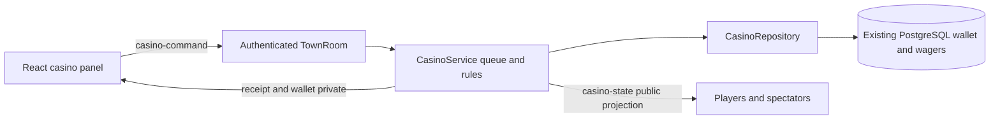

# Shared casino technical contract

Updated 10 September 2026 for the approved venue expansion and shared roulette landing. Fictional credits, local browser build, existing guest identity and wallet. No new accounts, network exposure or payment services. `shared/casino.ts` owns the public transport types, limits, paytables and world anchors.

## Architecture and integration

One `CasinoService` per `TownRoom` owns the stations in `CASINO_ANCHORS`: two independent roulette tables, six five-seat blackjack tables, 24 exclusive slot machines and one shared craps table. Keep the existing 50 ms movement simulation free of database work. A separate 250 ms casino tick advances deadlines. One serial operation queue covers the room’s casino actions and timer transitions, including database awaits. This keeps the local slice simple; a slow write can delay other casino tables, while movement remains on its separate simulation tick.

Service integration signatures:

- `constructor(roomId: string, repository: CasinoRepository, hooks: CasinoHooks)`
- `start(): void`, `tick(): Promise<void>`
- `handle(profileId: string, command: unknown): Promise<void>`
- `leave(profileId: string): void`, `dispose(): Promise<void>`
- Hooks: `actor(profileId): { sessionId: string; name: string; x: number; z: number } | undefined`; `publish(state: CasinoState): void`; `private(profileId: string, message: string, payload: unknown): void`; `wallet(profileId: string, snapshot: WalletState): void`.

Call repository migration/recovery after economy initialisation and before listening. Room admission binds every command to the authenticated profile; never accept a profile ID from its payload. After client handlers attach, `sync` requests the current public state and own roulette wagers. Publish wallet snapshots through the existing revision-aware private economy publisher.

## Transport and presentation

`casino-command` carries `CasinoCommand`; `casino-state` carries `CasinoState`; private `casino-receipt` carries `CasinoReceipt`; private `casino-private` carries `CasinoPrivateState`. Every command has an 8–100-character request ID. Responses preserve that ID; clients retain it on retry. Unknown actions, malformed numbers and unexpected table/game combinations fail without spending. Cache nonfinancial action receipts per round as well, so duplicate hit/stand requests cannot consume another card. Bound command size and request rate per session.

Public snapshots contain seat names, exposed cards, table phases, deadlines, previous roulette results and revealed slot results. Dealer hole cards are `null`; shoe order, unrevealed roulette outcomes, future reels and wallet balances never enter a public object. Roulette stake details are private to their owner and include `tableId`; both the panel and physical chip overlays filter by station and round. `serverTime` and epoch-millisecond deadlines support countdowns; server time alone admits actions. Occupant `connected` also becomes false when the player walks away. Spectators can inspect without occupying a seat.

Anchors are in `CASINO_ANCHORS`. Eligibility is within 3.2 metres of that anchor and inside the casino. Blackjack seat offsets form a south-facing semicircle looking toward the dealer; parent world integration owns seating poses. Leaving a panel alone does not cancel a stake. Slot machines release after their result period; blackjack vacant seats release immediately, staked seats after settlement.

Roulette uses the deterministic sampler in `shared/rouletteMotion.ts`. The server publishes a round ID, start time and starting wheel/ball angles. Only after settlement commits does it publish the winning number and a landing start 500 ms in the future. Every viewer samples that descriptor using the existing server-aligned monotonic clock, including spectators and late joins; frame rate and accumulated frame deltas do not choose the trajectory. The ball decelerates around the race, descends into its moving pocket and makes diminishing gravity/restitution bounces. The wheel continues coasting with the captured ball. This is a constrained presentation of the server's crypto-random result, not a physics-generated outcome. Network clock alignment and frame cadence still bound wall-clock synchrony.

The `landing` phase lasts through the scheduled 4.2-second descent/settle interval. Result text and history wait until this completes; wallet updates retain the existing commit-first behavior. A failed settlement keeps the ball orbiting without publishing a target, then schedules landing after a successful retry. The final motion descriptor remains during the next betting window so the wheel does not reset; the next spin starts from that resting pose. Reduced motion holds the previous pocket until the result phase, then shows the winning pocket without animation.

## Rules and timing

House-game base stakes are integer multiples of 10 from 10–100. Blackjack double/split adds the matching base stake. No wager cancellation or autoplay.

- **European roulette:** 20 seconds betting, five seconds spinning, settlement followed by a 500 ms landing lead and 4.2-second simulated landing, then six seconds result. Single zero; straight, adjacent split (including 0/1, 0/2, 0/3), street, zero trios {0,1,2}/{0,2,3}, corner, first four {0,1,2,3}, six-line, colour, parity, low/high, dozen and column. `numbers` must equal a canonical selection for its declared kind, with no duplicates. Zero loses every outside bet. Profit multipliers are in the shared contract; gross return adds the stake. Limit each player to 20 accepted bets and 1,000 total credits per table round. Start the next betting window after the result interval.
- **Blackjack:** 20 seconds betting, 30 seconds per hand action, six seconds result. Fresh shuffled six-deck shoe each round; server crypto Fisher–Yates. Dealer peeks for a natural, stands on soft 17; natural pays 3:2 profit, ordinary win 1:1, push returns stake. One split, only identical ranks (10/J is invalid), at most two hands. Split aces receive one card each and stand; split 21 is ordinary 21. Double allowed on the first two cards, including non-ace split hands, draws once and stands. No insurance or surrender. Natural/bust hands finish automatically. Timeout, disconnect or walking away stands active hands; accepted bets finish normally. A reconnected guest can reclaim its still-active seat. Only one initial bet per seat per round. No automatic stake for the next round.
- **Slots:** each of three independent reels has 16 equally likely stops: seven cherry, four lemon, three bar, two seven. Three matches pay gross 3×/8×/20×/50× respectively; exactly two cherries anywhere returns 1×; otherwise zero. Resolve and persist before a 2.5-second visual spin, then reveal and hold six seconds. No pending-credit animation is presented as a committed win. One occupant and one spin per machine; a profile may occupy only one blackjack/slot station at once.

The [poker contract](poker-design.md) adds six-seat player-versus-player Texas Hold’em, 5/10 blinds and separately held table chips with a 200–1,000-credit buy-in.

## Persistence, failures and concurrency

The [craps contract](craps-design.md) adds one Pass/Don't Pass wager per player per multi-roll cycle, shared shooter control and timestamp-sampled dice. Point rolls retain accepted wagers; terminal rolls settle before motion publication. Result text and point/history changes wait for landing.

Migration 003 adds durable wagers and extends permitted ledger kinds for casino stake, payout and refund. Migration 004 extends the wager game constraint for craps; migration 005 adds poker escrows/hands, and guest, economy and casino schema guards accept version 5. Reuse narrow economy transaction/lock/snapshot methods; do not copy grant creation or create a second wallet.

`casino_wagers`: ID UUID; profile UUID; room/table/round IDs; client request ID and canonical payload fingerprint; game; stake integer; status pending/settled/refunded; gross return integer nullable; server-only outcome JSON nullable; timestamps. Unique `(profile_id, request_id)`. Every debit and credit also has a unique ledger operation key. Blackjack double/split increments are separate durable wagers tied to the same round/hand, preserving their individual debit receipts.

Acceptance locks the existing wallet row, checks an existing receipt first, and then rechecks active session, proximity, phase/deadline, seat/turn and funds under the lock. A matching retry returns its prior acceptance even after departure/deadline; changed payload returns `request_conflict`. Atomic transaction commits debit, wager and ledger. Only then mutate visible game state. Rejected funding must never consume a card or advance the turn.

Settlement locks affected wallets in stable profile-ID order, then wager rows. It atomically records all round returns/statuses and ledger credits; retries see terminal status and cannot repay. Check balances remain representable by the existing integer column. Do not reveal an outcome or advance a new round until settlement commits. Ambiguous commits retry the same IDs/outcome; they never reroll. Database failures pause the table with accepted wagers retained.

This slice deliberately does not resume an in-memory round after process loss. Before accepting any sessions, refund every accepted/unsettled wager once in a transaction, including split/double increments. Terminal settled/refunded rows remain untouched. Room disposal first closes admission and drains in-flight queues, then refunds its unsettled wagers. Startup and disposal use the same terminal-status conditional write as settlement, so only one path can win. If recovery fails, casino admission stays unavailable; never silently discard pending wagers. Shutdown cleanup is best effort because startup recovery is authoritative.

## Acceptance evidence

Pure rule tests cover every roulette geometry and zero exception; blackjack natural, soft ace totals, peek, split aces, no resplit, double, bust and push; every slot paytable category. Inject RNG and clock only through server-side test seams. PostgreSQL tests cover duplicate and conflicting request IDs, concurrent clothing/salary/bet spending, unaffordable split/double, lock-delayed cutoff, ambiguous settlement retry, restart/refund repetition and settlement/refund races. Verify public serialization never contains the hole card, shoe or unrevealed results.

Verification combines two real protocol clients for shared results, private projections and seating with a headless browser journey for explicit stakes, wallet changes, responsive controls and final visible results. Deterministic rule/state tests cover disconnect handling and recovery; a separate renderer fixture covers rare split/hit/reveal presentations. Preserve native-device and 64-client capacity evidence boundaries. Ship art and UI against these contracts; unrelated quality or deployment work is outside this milestone.

`test:casino-network` also admits a third client during roulette landing and compares its motion descriptor with the owner and spectator. `test:roulette-motion` checks all 37 actual imported pocket centres, bed contact and divider clearance, plus matching poses in two browser renderers with different sampling histories. Unit tests cover continuity, deceleration, delayed settlement, frame-rate independence and the next launch. The full casino browser journey checks that the announced number matches the actual imported pocket containing the ball.
