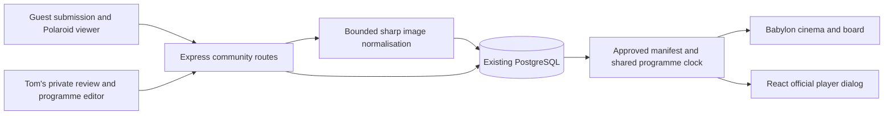

# Garden cinema and community Polaroids

11 September 2026. Implementation design for the approved western garden cinema, moderated community reel and examinable memories board. Existing React/Babylon.js presentation, Express routes, guest cookies and PostgreSQL remain the foundation.

## Experience and boundaries

The western cinema uses limestone, timber, evergreen framing, shallow seating terraces and warm lighting. Its 16:9 physical screen displays the community reel or an invitation to watch BridgeMind. Selecting “Watch together” opens an accessible watch dialog containing the official Twitch or YouTube player. It does not render an iframe into a Babylon texture. Streams start through a deliberate user action; closing the dialog destroys the player and stops its audio.

Between streams, still memes and promos display uncropped for 20 seconds with an optional creator credit. A schedule card appears every three images; an empty schedule says that the next stream is to be announced. Tom selects the live source and returns to intermission through the admin view. Schedule entries are confirmed UTC timestamps, displayed with a timezone; admin input uses explicit timezone handling. Browser player events do not control the shared programme. Automatic source discovery and exact video playback synchronisation are deferred.

The memories board becomes a collection of slightly rotated, cream-bordered Polaroids. Examining it opens a larger board view; clicking or keyboard-activating a photo expands the complete image. Back returns to the board and restores the selected photo's focus. Escape closes the current layer. Preserve `FIRST_MEMORY`, its original image and attribution; approved submissions join both the board and the reel, with admin controls to remove or feature them. Do not create duplicate placeholder memories to fill the board.

## Component ownership and contracts

| Module | Responsibility |
| --- | --- |
| `shared/community.ts` | Public image, submission, programme and schedule shapes; common limits and deterministic slide selection. No credentials or pending media in public types. |
| `server/persistence/community.ts` | Transactions, queue quotas, image bytes, moderation, programme revisions; reuse the existing guest database pool. |
| `server/community.ts` | Authenticated submission, private media, approved manifest, admin sessions, body limits and origin guards. |
| `src/community/` | Programme polling, submit/status form, Polaroid board/detail dialog, watch dialog, protected moderation and schedule views. |
| `src/world/cinema.ts`, `src/world/memoriesBoard.ts` | World geometry and dynamic display textures; consume approved data. Shared world layout owns physical collision. |

Recommended shared shapes (TypeScript notation):

- `CommunityImage`: `{ id: string; title: string; credit: string; imageUrl: string; width: number; height: number; featured: boolean; sortOrder: number }`.
- `CommunitySubmission`: image metadata plus `{ status: 'pending' | 'approved' | 'rejected'; createdAt: string }`, returned only to its owner or admin.
- `ScheduleEntry`: `{ id: string; title: string; startsAt: string; platform: 'twitch' | 'youtube' }`.
- `Programme`: `{ revision: number; epochMs: number; serverNowMs: number; mode: 'intermission' | 'live'; platform: 'twitch' | 'youtube'; twitchChannel: string; youtubeVideoId: string; schedule: ScheduleEntry[]; images: CommunityImage[] }`.

Return the epoch and ordered slides from one consistent database snapshot. Clients estimate server clock offset, then advance locally; poll every 15 seconds and refresh on tab visibility. Programme edits atomically increment revision and reset epoch. Image approval/removal also increments programme revision. Display a refresh state on initial failure; stop presenting stale media if the programme cannot refresh for 60 seconds. A removed image can remain visible on connected clients until refresh, so do not promise instantaneous revocation.

## Persistence and API

Add migration `008_community.sql` after social initialisation. Existing guest, economy, casino and social repositories all explicitly reject unknown versions: update all four supported-version checks to include 8, alongside the concurrent roulette migration 7. Do not modify previously applied migrations.

Persist `community_images` (UUID, nullable guest owner, title/credit, status, normalised image `bytea`, dimensions, sort/feature values, timestamps); a singleton `community_programme` (revision, epoch, mode, validated source identifiers, schedule JSON); and moderation decisions with timestamp. Keep admin session hashes and expiry in bounded process memory; restart signs the admin out. PostgreSQL image storage keeps approval and publication atomic and includes these small assets in existing database backups. Revisit object storage only if image volume warrants it.

All paths below are external `/game/api/community`; Express mounts the corresponding `/api/community` paths.

| Method and suffix | Request and response | Access |
| --- | --- | --- |
| `GET /programme` | `200 Programme` | Public; approved metadata only |
| `GET /images/:id` | `200 image/webp`, otherwise `404` | Public only while approved; `no-store`, `nosniff` |
| `POST /submissions` | `{ title: string; credit: string; imageBase64: string }` → `201 CommunitySubmission` | Existing guest cookie |
| `GET /submissions` | `200 { submissions: CommunitySubmission[] }` | Owner only |
| `GET /submissions/:id/image` | `200 image/webp`, otherwise `404` | Owner or admin; `private, no-store` |
| `POST /admin/login` | `{ password: string }` → `204` and cookie | Rate-limited; same-origin |
| `POST /admin/logout` | Empty → `204`, revoke token | Admin |
| `GET /admin` | Programme and bounded review queue, or `401` | Admin |
| `PATCH /admin/images/:id` | `{ status?: 'approved' | 'rejected'; featured?: boolean; sortOrder?: number }` → updated metadata | Admin |
| `DELETE /admin/images/:id` | Empty → `204`; remove bytes and metadata | Admin |
| `PUT /admin/programme` | Programme settings and expected `revision` → updated programme | Admin; stale revision `409` |

Errors use `{ error: string }`: `400` invalid fields/image, `401` authentication, `403` origin, `404` unavailable image, `409` stale update, `413` oversized body, `429` quota/rate limit, `503` service unavailable. No raw decoder/database errors reach browsers. Validate title ≤100 characters, credit ≤80, schedule ≤20 entries, and only platform identifiers; never accept arbitrary iframe URLs or HTML.

## Upload and administrator safeguards

Accept JPEG, PNG and WebP still images, at most 4 MiB decoded input and 12 megapixels. Use `sharp` to decode, reject animated/multipage inputs, apply orientation, resize inside 1920×1080 without enlargement and re-encode WebP without metadata; cap output at 1 MiB. Header/MIME inspection alone is insufficient. Set Express JSON limit to 6 MiB for base64 overhead; authenticate and rate-limit before body decoding. Limit two active decoder jobs and reject excess promptly. Sharp supports input pixel limits; configure them explicitly. [Sharp constructor documentation](https://sharp.pixelplumbing.com/api-constructor/)

Enforce at most 5 pending images per guest, 50 pending globally and 200 retained images overall in a database transaction protected by a shared quota lock. Daily persisted submission cap: 10 per guest and 100 globally, plus a bounded coarse IP/global request limiter. Guest-cookie recreation can bypass per-guest limits; the global quota and request limiter remain necessary. Reject unsupported/oversized data without retaining original bytes. Private pending image URLs perform an ownership check on every read.

Configure only a server-side `COMMUNITY_ADMIN_PASSWORD_HASH` using salted scrypt, verified with a timing-safe comparison. No public environment variables, source constants or browser storage contain credentials. Missing configuration disables admin login and displays an honest setup state. Issue a random 32-byte opaque cookie scoped to `/game/api/community`, `HttpOnly`, `SameSite=Strict`, `Secure` for HTTPS, with an eight-hour fixed expiry; store only its hash. Permit at most 5 login attempts per 15 minutes per observed IP plus a global cap; do not trust forwarded IP headers without an explicit trusted proxy configuration. Every mutation uses the existing exact-origin guard, including login and logout. Never log passwords, cookies or image bodies.

## Playback constraints and verification

Twitch requires its embedding hostname in `parent` and a player at least 400×300 CSS pixels. On narrower portrait screens, offer “Open on Twitch” and a rotate hint; never shrink the player below that limit. Its online/offline events describe a viewer's player state, not trusted programme control. [Twitch official embed documentation](https://dev.twitch.tv/docs/embed/video-and-clips/)

YouTube uses a validated video ID in its official embed. Tom curates BridgeMind video IDs manually; the server does not verify channel ownership. Preserve the browser's referrer needed for player identification and supported player dimensions. Provide the provider link when embedding is disabled or unavailable. [YouTube player parameters](https://developers.google.com/youtube/player_parameters)

Ship in three dependent steps: persistence/auth/upload routes (M), accessible board/submission/admin/watch views (L), then world cinema integration and headless acceptance (L). No substantial existing-system refactor is required.

Acceptance covers unauthenticated/admin spoofing and cross-origin mutations; private image access by a second guest; corrupt, animated and oversized image rejection; concurrent queue caps; approval/removal publication; restart persistence and expired admin sessions; stale programme revision; shared slide timing across two browser contexts; board examine→photo→back focus; desktop, portrait and 844×390 landscape layouts; muted/unmounted player behavior and provider failure. Run affected Node tests, frontend/server builds and database-isolated integration tests; perform actual headless world screenshots and community journeys. Configured embeds and mocked provider responses do not establish a working BridgeMind live broadcast. No production deployment is authorised by this implementation design.

## Verified implementation — 11 September 2026

Evidence below applies to the isolated `cinema-community` checkout, including the casino/chat changes present at integration. Separate safety work began changing shared server and proxy files in the main workspace during finalisation; those later edits were preserved and are outside this verification scope.

- Integrated database-inclusive Node 24 suite: **162 passed, zero failures or skips**. Includes migration 008 alongside roulette migration 007, private media, moderation, queue limits and restart behaviour. Client and server builds and whitespace checks passed.
- Headless community UI: seven journeys passed using real local APIs. Desktop, 390×844 portrait and 844×390 landscape cover uploads, approval/rejection/removal, schedule editing, Polaroid zoom and full-image focus restoration. Two browser contexts advanced through the same real slide boundary with one clock deliberately 20 seconds ahead.
- Headless world journey passed: physical board collision/click, central cinema ramp, all seating contracts, actual server seat/stand, avatar terrace height and Sit animation. Phone cinema controls remain visible and separate. Actual day/night renderer captures are under ignored `output/playwright/cinema-render/`.
- Disposable Linux Compose build and lifecycle check passed: ten clients over proxied WSS, native image decoding, private pending uploads, game restart and a backup restored into a separate test database. Community image bytes and programme revision matched after restore. The nginx upload template separately passed `nginx -t`. Test containers and volumes were removed.
- The real BridgeMind Twitch embed loaded and reported the channel offline. Provider layout/lifecycle tests used stubbed documents; live broadcast playback, audio, physical-device performance and exact video synchronisation are not established. The 3D screen presents approved stills/schedules and a live invitation; video opens in the official player dialog.

Changes are local and uncommitted. Administrator login remains disabled until Tom sets his own password using `npm run community:admin-password` and restarts the development server. A production release and the host nginx update remain separately authorised operations.
